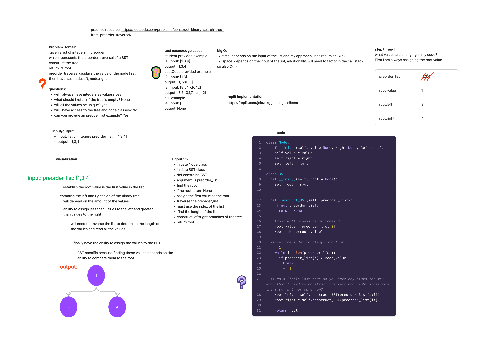

## Peak Index

Given a list of integers in preorder, which represents the preorder traversal of a BST
construct the tree
return its root

[LeetCode challenge link:](https://leetcode.com/problems/construct-binary-search-tree-from-preorder-traversal/)

Arguments: input in preorder
Return: root

### Whiteboard Process

### Approach and Efficiency

Time: depends on the input of the list and my approach uses recursion,

which I was considering, but ultimately this is okay because it is constant O(n)

Space: depends on the input of the list, additionally, will need to factor in the call stack,
so also O(n)

### Solution

[Construct a BST](https://replit.com/join/qkggmscngh-elleem)
