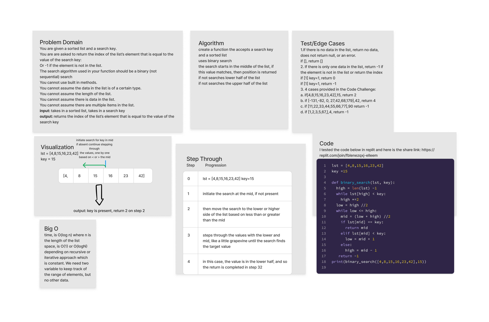

## Reverse a List

Write a function called `BinarySearch` which takes in 2 parameters: a sorted list, and the search key.

Be sure to use the binary search method in your algorithm.

Without utilizing any of the built-in methods available to your language, return the index of the list's element that is equal to the value of the search key or -1 if the element is not in the array.

### Whiteboard Process

### Approach and Efficiency

I took an iterative approach, by first comparing the search key to middle element of the array. If they do not match, then the function can eliminate the half that the search key does not exist in, and continue on through the remaining half. Each iteration repeats the search until the target is found and then returns the index.

### Solution

[replit](https://replit.com/join/fblenezqxj-elleem)
