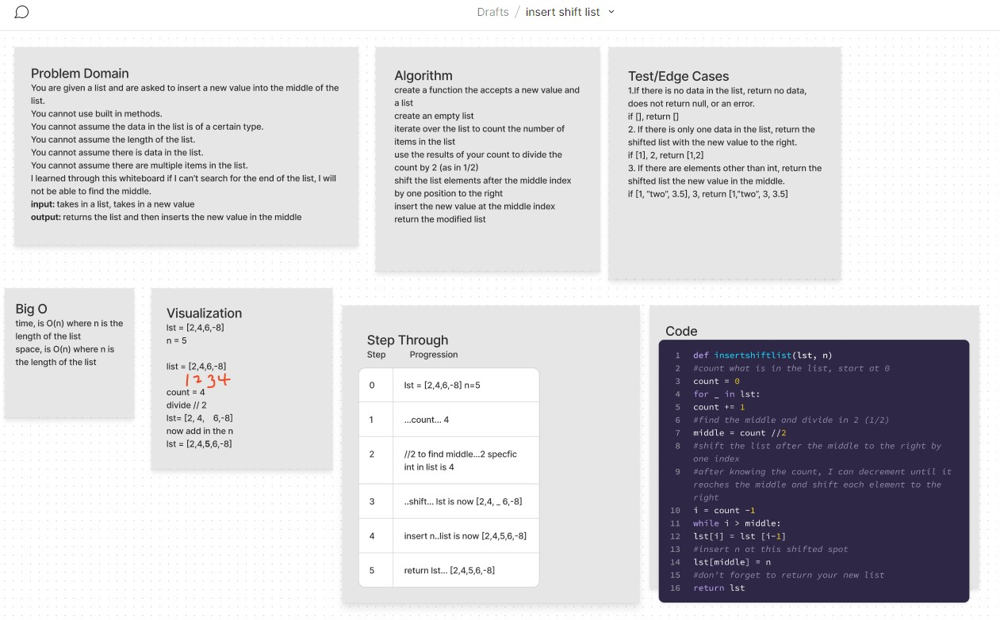

## Insert Shift List

Write a function called `insertshiftlist` which takes a list and a new value to be added.

Without utilizing any of the built-in methods available to your language, return a list with the new value added at the middle index.

### Whiteboard Process

### Approach and Efficiency

### Solution

Emitted because this is a whiteboard only challenge at this time.
