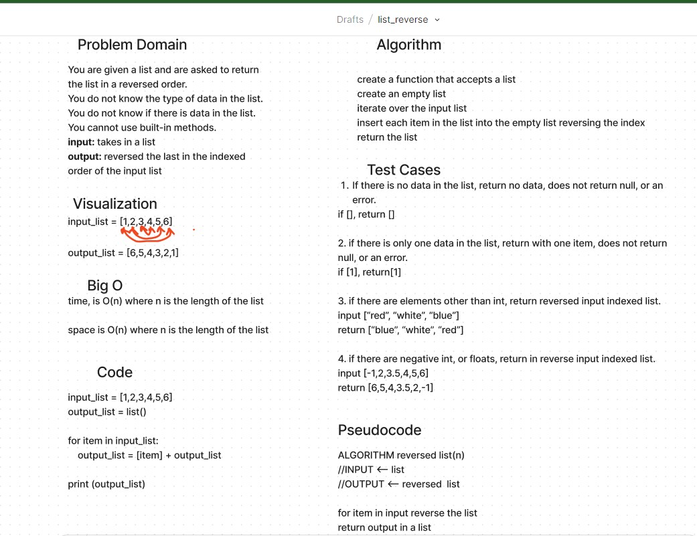

## Reverse a List

Write a function called `reverse_list` which takes an array as an argument.

Without utilizing any of the built-in methods available to your language, return a list with elements in reversed order.

### Whiteboard Process

### Approach and Efficiency

This approach uses a for loop to create a list in reverse order.

Resources for Big O include:

[Stackoverflow](https://stackoverflow.com/questions/37606159/what-is-the-time-complexity-of-python-list-reverse)

and
[datagy](https://datagy.io/python-reverse-list/)

