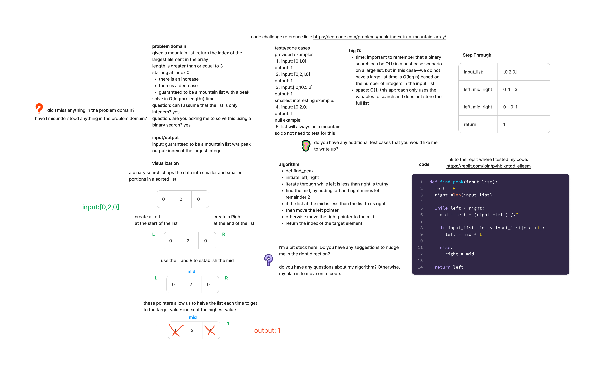

## Peak Index

Given a mountain list, return the index of the largest element in the array

Solve in O(log n) time.

[LeetCode challenge link:](https://leetcode.com/problems/peak-index-in-a-mountain-array/)

Arguments: input list
Return: index of the largest element in the array

### Whiteboard Process

### Approach and Efficiency

Time: it is important to remember that a binary search can be O(1) in a best case scenario on a large list, but in this case--we do not have a large list time is O(log n) based on the number of integers in the input_list

Space: O(1) this approach only uses the variables to search and does not store the full list

### Solution

[Peak Index](https://replit.com/@elleem/findpeak#main.py)
