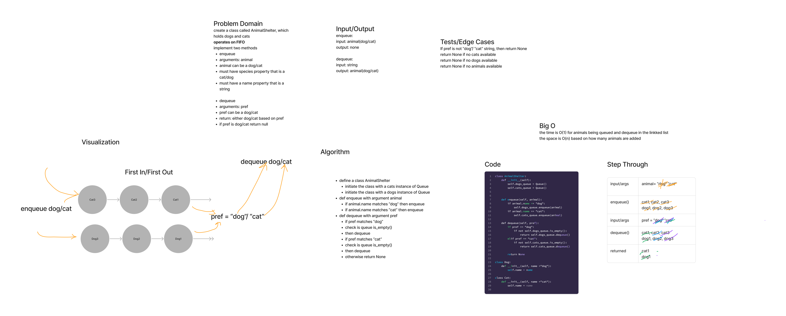

## Stack Queue Animal Shelter

Create a class called AnimalShelter which only holds dogs and cats, using FIFO.

Initialize two Stack instances to create and manage the queue.
Define an enqueue method, arguments: animal
allows animal -- cat or dog -- and adds to the queue
Define a dequeue method, arguments: pref
accepts pref and returns the cat or dog that matches using FIFO

### Whiteboard Process

### Approach and Efficiency

I have solved this using simple checks for does the animal match the string to enqueue.
And then I have checked the pref for a match before dequeueing, based on FIFO.
The time is O(1) for animals being queued and dequeue in the linkked list.
The space is O(n) based on how many animals are added.

### Solution

[Stack Queue Animal Shelter](Stack-Queue-Animal-Shelter.jpg )
