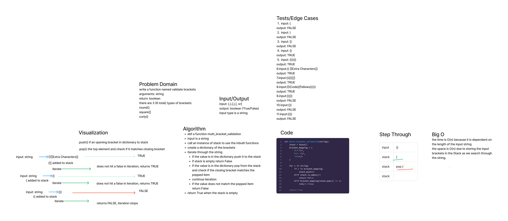

## Stack Queue Brackets

Write a function called validate brackets.

Arguements: string

Return: Boolean -- checking if brackets in the string are balanced.

### Whiteboard Process

### Approach and Efficiency

Store the 6 unique values in a dictionary and then add the opening brackets to the stack.

Pop the opening bracket out of the queue and if there is not a match in the ending brackets return False.

The time is O(n) because it is dependent on the length of the input string.

The space is O(n) due to storing the input brackets in the Stack as we search through the string.

### Solution

[Stack Queue Bracket](stacks-queues-brackets.jpg)
