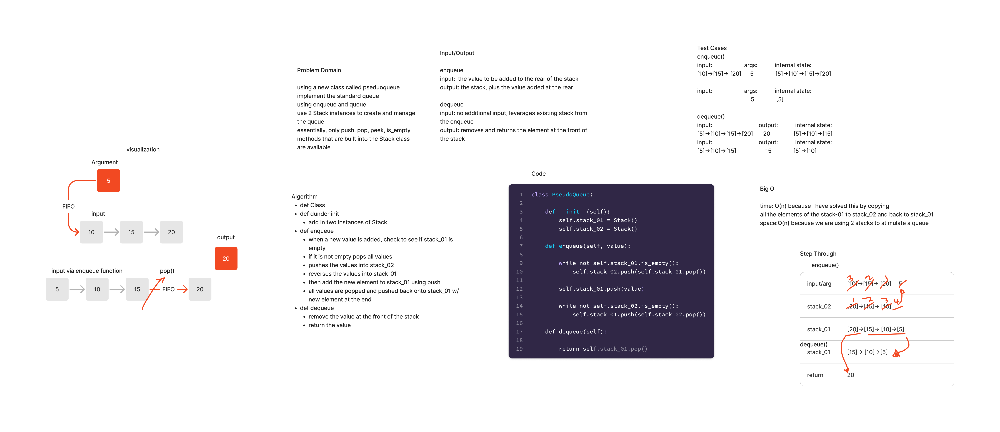

## Stack Queue Pseudo

Create a new class called pseudo queue.
Do not use an existing Queue.
Initialize two Stack instances to create and manage the queue.
Define an enqueue method, arguments: value
inserts a value into the PseudoQueue, using FIFO.
Define a dequeue method, arguments: none
extract a value from the PseudoQueue, using FIFO.

### Whiteboard Process

### Approach and Efficiency

I have solved this by copying all the values of stack_01 to stack_02 to add the value and back to stack_01.
Then I can return the correct value, using pop().
Additionally, we are using two stacks to stimulate a queue, so O(n) for time and space.

### Solution

[Stack Queue Pseudo](stack-queue-pseduo.jpg)
