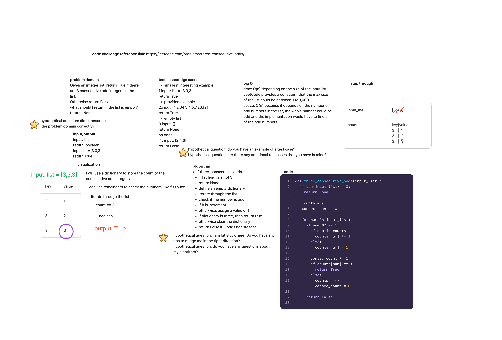

## Three Odds

Write a function that finds the three consecutive odds in a list

Arguments: list, must have more than 3 integers
Return: a boolean True/False depending on if there are 3 consecutive integers

### Whiteboard Process

### Approach and Efficiency

The time is O(n) based on the size of the input list.
LeetCode provides a constraint that the max size of the list could be between 1 to 1,000

The space is O(n) based on the number of odd numbers in the list, the whole number could be odd and the implementation would have to find all the odd numbers

### Solution

[Three Odds](code_challenges/three_odds.py)

### Tests

[Three Odds Tests](tests/code_challenges/test_three_odds.py)
