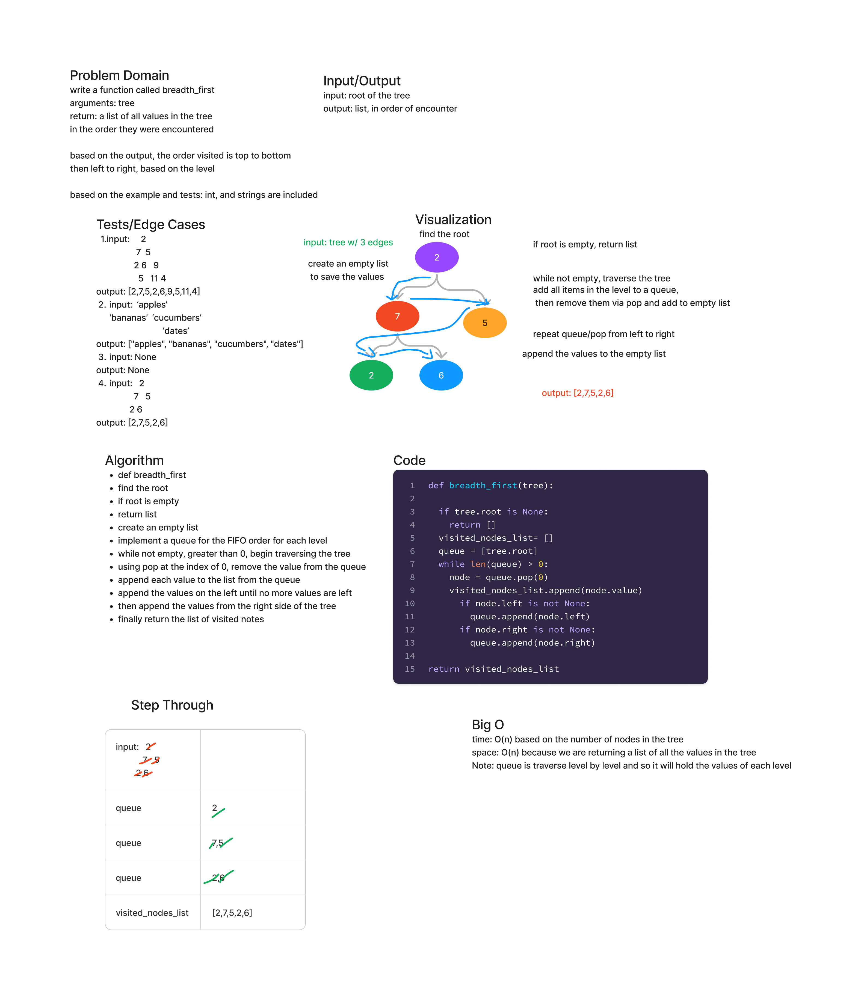

## Tree Breadth First

Write a function called breadth_first

Arguements: tree

Return: a list of all values in the tree
in the order top to bottom, per level, left to right

### Whiteboard Process

### Approach and Efficiency

Find the root, then using a queue for each level traverse the tree.
Pop each node value into an empty list.

The time is O(n) based on the number of nodes in the input parameter, the tree.

The space is O(n) because we are returning a list of all the values in tree and must store the values in the list.

### Solution

[Tree Breadth First](code_challenges/tree_breadth_first.py)
