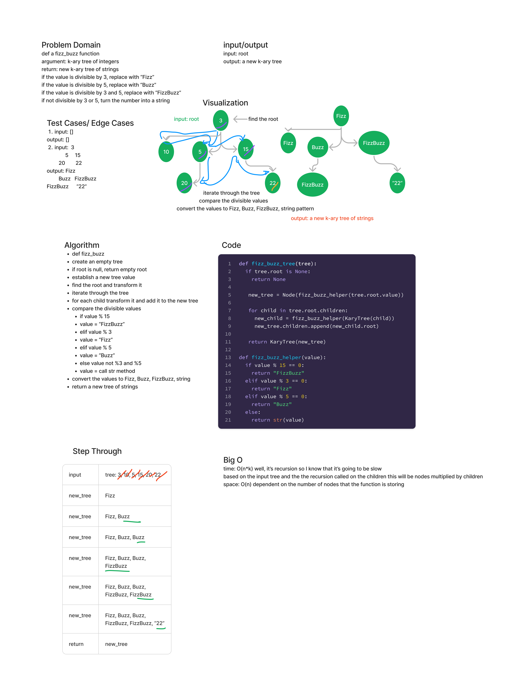

## Tree Fizz Buzz

Write a function called fizz_buzz_tree

- If the value is divisible by 3, replace the value with “Fizz”
- If the value is divisible by 5, replace the value with “Buzz”
- If the value is divisible by 3 and 5, replace the value with “FizzBuzz”
- If the value is not divisible by 3 or 5, simply turn the number into a String.

Arguments: k-ary tree
Return: new k-ary tree

### Whiteboard Process

### Approach and Efficiency

Using recursion, iterate through the input tree. Convert the root, then convert each child and re-append to the new_tree value.

The time is O(n*k) because the number of the nodes in the tree and the number of children in the tree .

The space is O(n) depends on the input number of nodes in the tree,
because the requirements are to return a new tree, we must store each value once it is converted by the helper function.

### Solution

[Binary Tree Maximum Value](code_challenges/tree_fizz_buzz.py )
