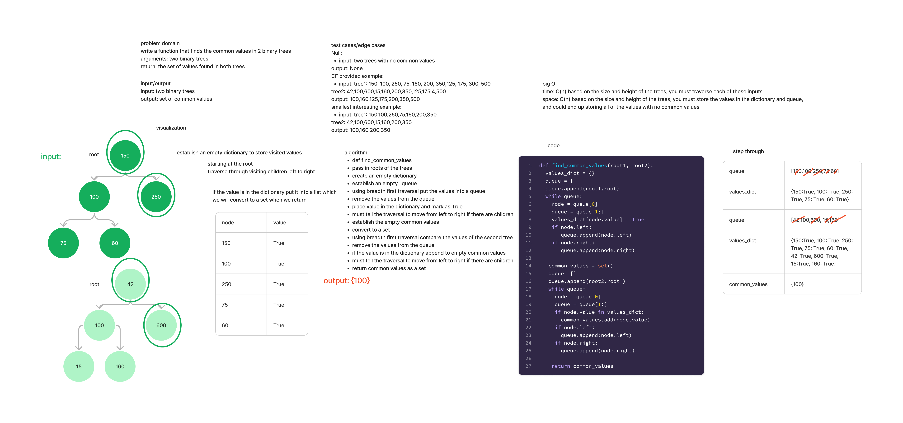

## Tree Intersection

Write a function that finds the common values in 2 binary tree

Arguments: two binary trees
Return: the set of values found in both trees

### Whiteboard Process

### Approach and Efficiency

The time is O(n) based on the size and height of the trees, you must traverse each of these inputs.

The space is O(n) based on the size and height of the trees, you must store the values in the dictionary and queue,
and could end up storing all of the values with no common values.

### Solution

[Tree Intersection](code_challenges/tree_intersection.py)
