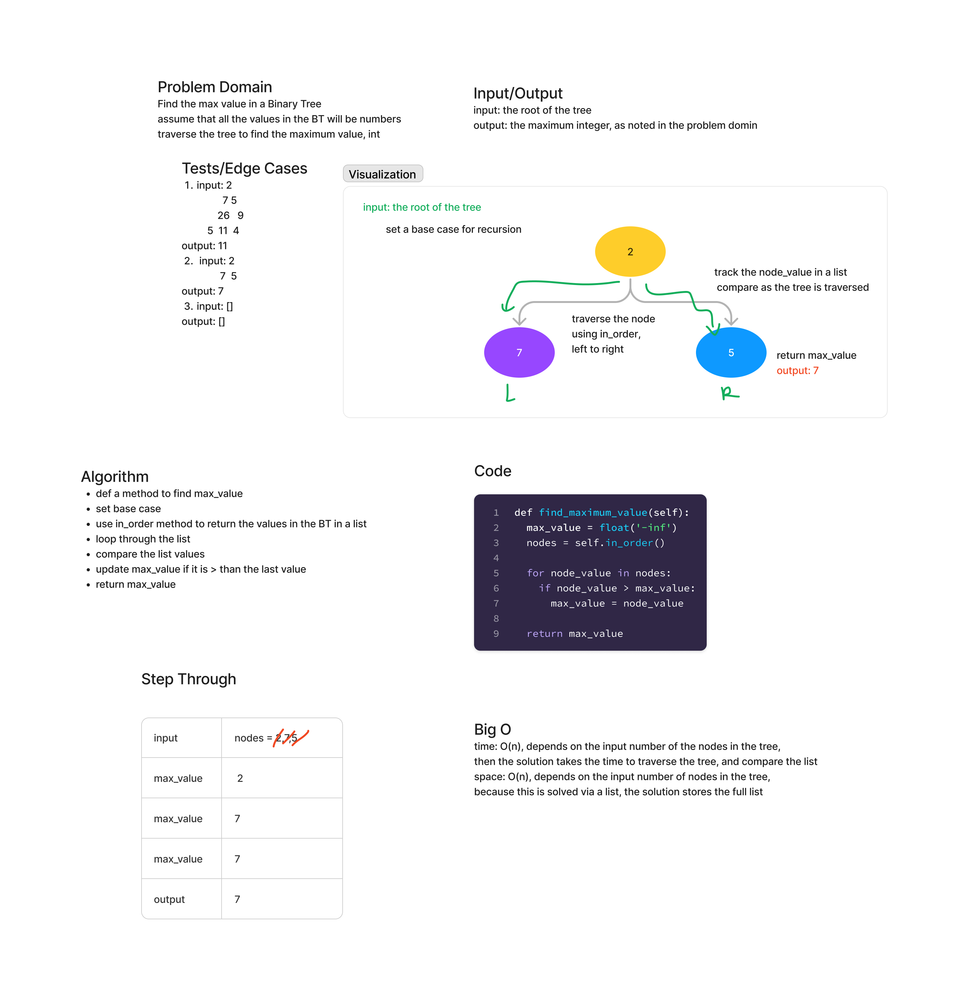

## Tree Maximum Value

Find the maximum value in a tree.
Arguments: none
Return: number

### Whiteboard Process

### Approach and Efficiency

Using in_order traverse the tree, store the values in a list, compare the current value to the max value
and update if greater than.

The time is O(n) because the solution depends on the input number of the nodes in the tree.

Then the solution takes the time to traverse the tree, and compare the list.

The space is O(n) depends on the input number of nodes in the tree,
because this is solved via a list, the solution stores the full list

### Solution

[Binary Tree Maximum Value](data_structures/binary_tree.py)
