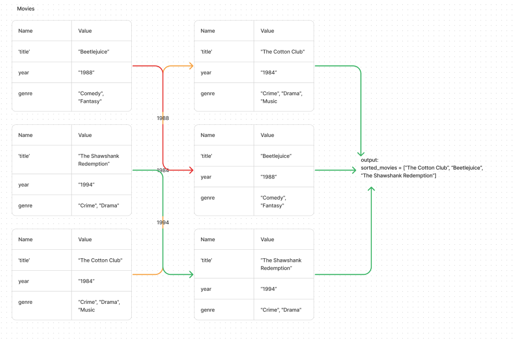

# Blog Notes: Comparison Sort

### Comparison Sort

Insertion sort is a sorting algorithm that takes a comparator callback and two parameters (`a` and `b`), and returns a number.

When the number is < than 0: the `a` param is sorted to the left of `b`: -1

When the number is > than 0: the `a` param is sort to the right of `b`: 1

When the number is == 0: it doesn't matter the order

in JS and Python we can still use the < >  for evaluation.

### Problem Domain

Write functions to sort domain objects.

One function will sort the movies by most recent year first.

One function will sort the movies, alphabetical by title, but will ignore any leading “A”s, “An”s, or “The”s.

### Input/Output

Input: a list of unsorted movie objects.

Output: a list of sorted movie objects.

### Visualization

### Algorithm

def for year

use builtin python sorted() method

use a lambda function within the sorted function to assign the year as a key

def for title

strip the "a", "an" and "the" from the titles

then use the builtin python sorted() method

use a lambda function with the key of title to assign the year as key

### Tests

Test outputs for these functions.

Your tests will need to call the comparator functions directly, and make assertions about the response values given test inputs.

The tests pass and are available at sorting/comparisons/test_movies.py

### Big O

sort by year

time:  O(n log n) due to sorted comparing between the year and title for each movie in the dictionary, where n is the number of movies.

space: O(n) we store all the movies in the sorted movies to output the resulting list of titles

sort by title

time: O(n log n) due sorted, where n is the number of movies.

space: O(n) we store all the movies in the sorted movies to output the resulting list of titles
