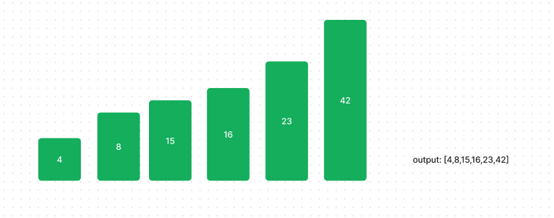

# Blog Notes: Insertion Sort

### Insertion Sort

Insertion sort is a sorting algorithm that traverses a list, in order to sort it.
As it traverses it compares each element to the element before it and inserts it into the correct position.

### Problem Domain

### Input Output

### Pseudocode

### Visualization

### Algorithm

### Code

### Step Through

### Big O
Insert:
time: O(n)where the whole input list has to be traversed to be compared
space: O(n) I am not creating an additional list, I am only sorting through it using the temp value

InsertionSort:
time:  I am using def insert within InsertionSort, so at least O(n^2), due to the function being called internally
and the potential input of the input list
space: O(n) if I have to store and sort the whole list

### Tests

