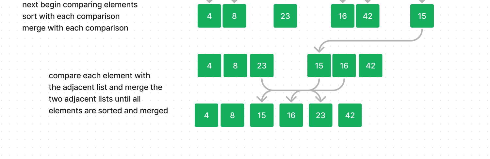

# Blog Notes: Merge Sort

### Merge Sort

A popular sorting algorithm that follows the divide-and-conquer approach to sort a list of elements, recursively.

### Problem Domain

Divide the unsorted lists into n sublists, each containing one element

Repeatedly merge sublists to produce new sorted sublists until there is one sublist remaining.

Return the sorted list.

### Input Output

input: [8,4,23,42,16,15]

output: [4,8,15,15,16,23,42]


### Pseudocode

```pseudo
ALGORITHM Mergesort(arr)
    DECLARE n <-- arr.length

    if n > 1
      DECLARE mid <-- n/2
      DECLARE left <-- arr[0...mid]
      DECLARE right <-- arr[mid...n]
      // sort the left side
      Mergesort(left)
      // sort the right side
      Mergesort(right)
      // merge the sorted left and right sides together
      Merge(left, right, arr)

ALGORITHM Merge(left, right, arr)
    DECLARE i <-- 0
    DECLARE j <-- 0
    DECLARE k <-- 0

    while i < left.length && j < right.length
        if left[i] <= right[j]
            arr[k] <-- left[i]
            i <-- i + 1
        else
            arr[k] <-- right[j]
            j <-- j + 1

        k <-- k + 1

    if i = left.length
       set remaining entries in arr to remaining values in right
    else
       set remaining entries in arr to remaining values in left

   ```

### Visualization




### Algorithm

```pseudo

def merge_sort
find the length of the input list
if the length is greater than 1
then create a mid point
split the list into left and right hand sides
recursively call the merge_sort to sort the input list
use the merge function to merge the left list, right list


def merge
input the left list, right list and input list
set the three lists to a value of zero
iterate through the left list, right list and compare and merge
compare the elements of the list,
  if left is less than or equal to the right
  copy to the input list
increment through the list
continue merging and sort through each of the lists
return the sorted input_list


```

### Code

```python
def merge_sort(input_list):
    n = len(input_list)

    if n > 1:
        mid = n// 2
        left = input_list[:mid]
        right = input_list[mid:]

        merge_sort(left)
        merge_sort(right)

        merge(left, right, input_list)


def merge(left, right, input_list):
    i = j = k = 0
    while i < len(left) and j < len(right):
        if left[i] <= right[j]:
            input_list[k] = left[i]
            i += i
        else:
          input_list[k] =right[j]
          j += 1
        k += 1

    while i < len(left):
        input_list[k] = left [i]
        i += 1
        k += 1

    while j < len(right):
        input_list[k] = right[j]
        j += 1
        k += 1

  ```


### Step Through

### Big O
merge:

time: O(n) because n is the total number of elements in the merged lists

space: O(n) because n is the total number of elements in the merged lists, merging is being done in place

merge_sort:

time: O(n log n) n is the total number of elements in the input list, accounting for the left and right lists, and the recursive stack

space: O(n) due to recursive call stack

### Tests/Edge cases

reverse-sorted:

input: [20,18,12,8,5,-2]

output: [-2,5,8,12,18,20]

few uniques:

input: [5,12,7,5,5,7]

output: [5,5,5,7,7,12]

nearly-sorted:

input:[2,3,5,7,13,11]

output: [2,3,5,7,11,13]

```python
def test_merge_sort():
  input_list = [8,4,23,42,16,15]
  expected_output = [4,8,15,15,16,23,42]
  sorted_list = merge_sort(input_list)
  assert sorted_list == expected_output

def test_merge_reverse_sort():
  input_list = [20,18,12,8,5,-2]
  expected_output = [-2,5,8,12,18,20]
  sorted_list = merge_sort(input_list)
  assert sorted_list == expected_output

def test_few_uniques():
  input_list = [5,12,7,5,5,7]
  expected_output = [5,5,5,7,7,12]
  sorted_list = merge_sort(input_list)
  assert sorted_list == expected_output

def test_nearly_sorted():
  input_list = [2,3,5,7,13,11]
  expected_output = [2,3,5,7,11,13]
  sorted_list = merge_sort(input_list)
  assert sorted_list == expected_output
  ```
